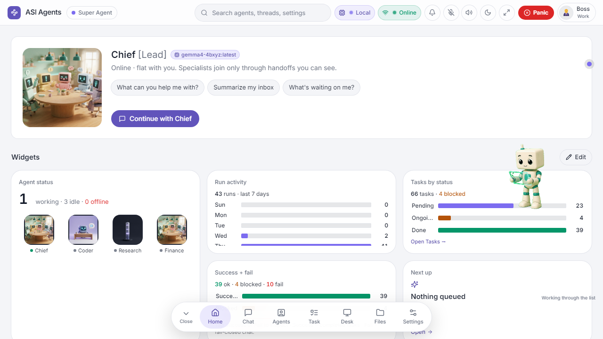

<div align="center">

# ASI Agents

### Local-first desktop AI · Chief + agents on your machine

**Research preview** · **v0.1 Pre Release** · Port **3445** · Snapdragon X ready

</div>

---

<p align="center">
  
</p>

Welcome! **ASI Agents** is a local-first app for running work like an executive office — a **Chief of staff** and agents that stay private by default. Local models when you want them, cloud only when you opt in. **No account required to start.**

This package is a **v0.1 Pre Release** for GitHub upload and Snapdragon deploy. APIs and UI may change — explore kindly.

> **First run?** Double-click **`start-asi.cmd`**, then open http://127.0.0.1:3445

## Getting started

**One click (Windows / Snapdragon):** double-click **`start-asi.cmd`** (setup + build on first run).

**Or three commands** (Node **20+**; prefer **ARM64** on Snapdragon X / Galaxy Book4):

```powershell
npm.cmd run setup
npm.cmd run build
npm.cmd run start
```

**AMS weights** ship inside this package: `models/ams/ams-micro-70m.onnx` + `ams-hybrid-120m.onnx`. Verify with `npm run verify:ams`. Optional chat models: `.\scripts\pull-models.cmd` (Ollama + AMS verify). Without a chat backend, Chief returns **503** (fail-closed).

## Two modes

| | **Simple** | **Pro** |
|---|------------|---------|
| **Feel** | Chat + terminal view | Full dashboard |
| **Who's there** | One agent + Chief | Chief spawns agents, roles, hierarchy |
| **Best for** | Fast daily chat | Research, builds, org-scale workflows |

## Modules out of the box

| Module | First-run |
|--------|-----------|
| **Virtual Computer** | Installed. Desk daemon on `:3456` is **optional** — set `ASI_DESK_REPO` only if you have a Desk install. Offline = honest empty status. |
| **Companion** | **ON** automatically on `localhost` / `127.0.0.1`. Elsewhere: Settings → Modules → Show Squari. |

Arcade / games are **not** in this package. Postgres stays off (files by default).

## Highlights

- Per-agent primary + secondary models with visible handoffs
- Local answer layer · managed browser on demand
- Hardware scan → recommended local models
- AMS Micro + Hybrid bundled when weights are present

## License

[`LICENSE`](LICENSE) — MIT

---

<div align="center">

**ASI Agents** · research preview · transparent handoffs · local-first · no account to start

</div>
