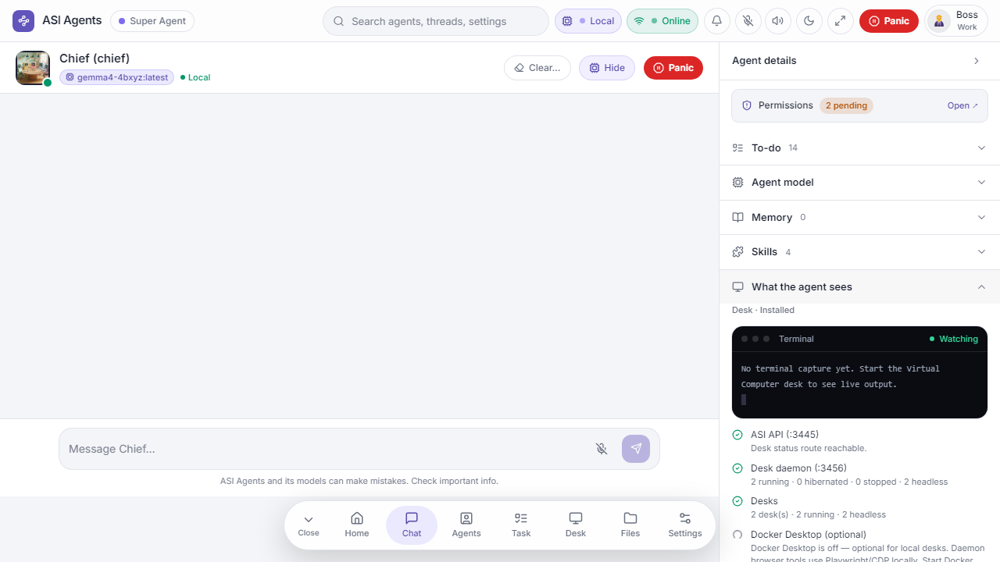
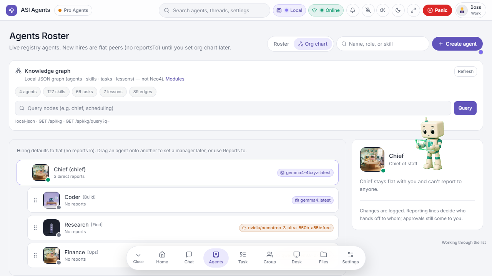
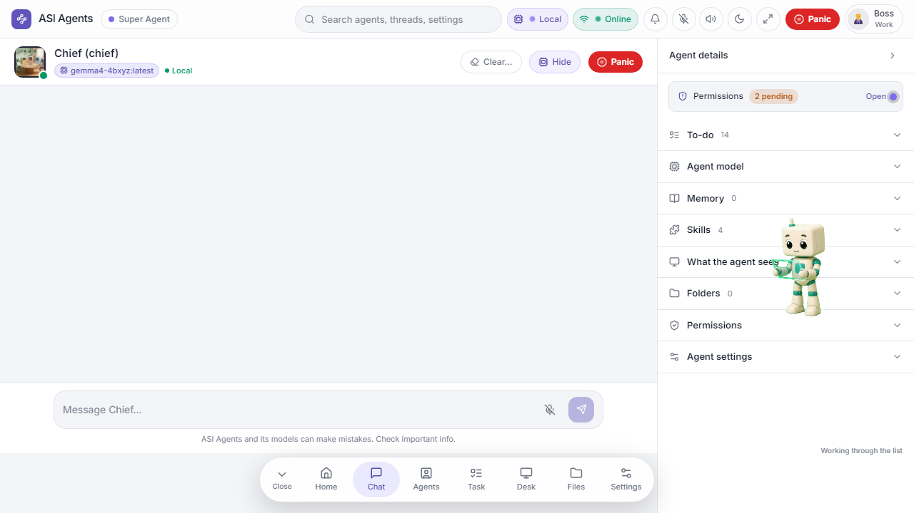
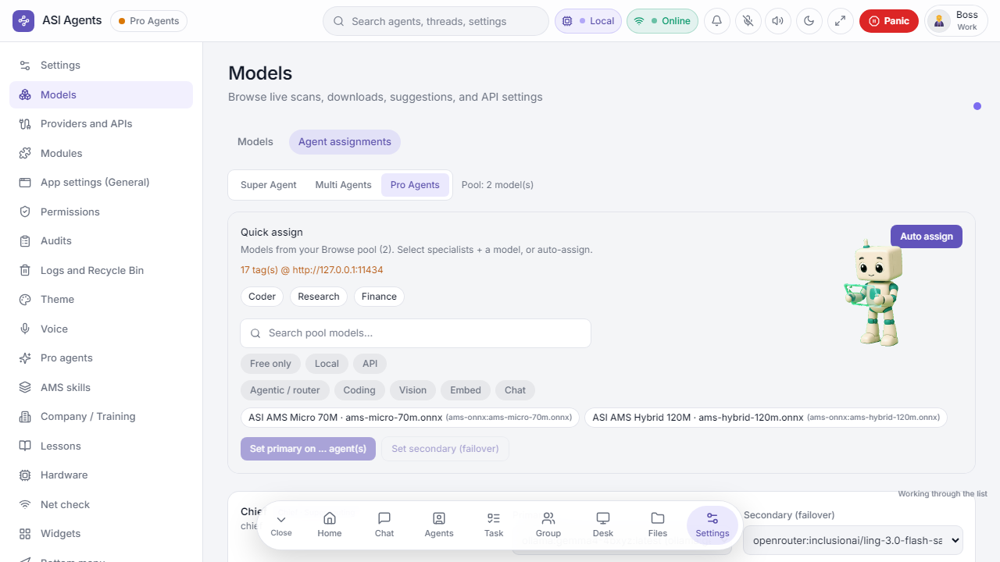

<div align="center">

# ASI Agents

**Local-first multi-agent desk — a Chief, specialist agents, and an on-device intent router that decides what ever reaches an LLM.**


[](LICENSE)
[](#whats-next-research)
[](#getting-started)

**v0.1 Pre Release** · Port **3445** · Windows / Snapdragon X ARM ready · [Apache-2.0](LICENSE)

[Why router-first](#why-router-before-chatbot) · [Screenshots](#screenshots) · [Getting started](#getting-started) · [Architecture](#architecture--stack) · [AMS models](#ams-models-in-this-package) · [Modes](#modes) · [Modules](#modules) · [Security model](#security--approvals) · [Hardware](#hardware-targets) · [Contributing](#contributing--feedback) · [License](#license)

</div>

<p align="center"><em>Chief · specialists · skills · Virtual Desktop — companion display now, wearable track next.</em></p>

---

## Why router-before-chatbot?

Every message in a typical agent stack goes straight to an LLM — expensive, slow, and leaky. **ASI Agents** inserts a cheap, private, on-device step first: **AMS**, a ~70M-parameter intent router (ONNX) that classifies what you want and only escalates to a chat model when local handling isn't enough.

```text
You ──► AMS intent router (on-device, ~70M ONNX)
          ├── handled locally ──► skills / tools / canned flows
          ├── needs reasoning ──► local chat model (Ollama etc.)
          └── needs frontier  ──► cloud provider (explicit, logged, approved)
```

- **Private by default** — intents classified on your hardware; nothing leaves the machine unless a route says so. No account required to start.
- **Cheap** — milliseconds per message instead of a frontier-model round trip.
- **Auditable** — every routing decision is visible in the desk and written to the audit log.
- **Human in the loop** — Approve / Ask more / Reject on consequential actions, draft-first mail, and a **Panic** kill-switch in the header.

It is **not** a single-box chatbot demo — it is a **suite** meant to sit beside daily work: desk UI, Virtual Desktop, companion display, and a longer path toward **wearable** tools.

---

## Screenshots

Product UI from this pre-release ([`docs/screenshots/`](docs/screenshots/)):

| Home | Simple chat | Pro dashboard |
|:---:|:---:|:---:|
|  |  |  |

| Companion display | AMS handoff |
|:---:|:---:|
|  |  |

<details>
<summary>Team / brand stills</summary>

<p align="center">
  
  &nbsp;
  
</p>

</details>

---

## Architecture / stack

```text
  You  (browser · companion · future wearable)
   │
   ▼
 AMS on-device router
   · AMS Micro ~70M  (default)   → models/ams/ams-micro-70m.onnx
   · AMS Hybrid ~120M (optional) → models/ams/ams-hybrid-120m.onnx
   · closed-schema intents · escalate only when needed
   │
   ▼
 ASI Agents desk  (:3445)
   · Super Agent · Multi Agents · Pro Agents
   · skills · approvals · draft-first inbox · Panic
   · primary + secondary model handoffs (visible)
   · per-turn cost tracing · audit log
   │
   ▼
 Virtual Desktop / Computer
   · apps · browser · files  (desk daemon :3456 optional)
   │
   ▼
 Companion display (Squari) · wearable research track
```

**Stack:** TypeScript monorepo · Express server · React + Vite + Tailwind · ONNX Runtime · pluggable chat backends (local via Ollama, or any OpenAI-compatible provider).

**Design principles (pre-release):**

1. **Local-first** — no account required to start; cloud is escalation, not the default.
2. **Router before chatbot** — AMS classifies intent cheaply on-device; chat LLMs are targets, not the front door.
3. **Human in the loop** — Approve / Ask more / Reject; draft-first mail; Panic in the header.
4. **Visible routing** — you should see when Micro vs Hybrid vs chat backend is used.
5. **Suite, not a single pane** — desk + Virtual Desktop + companion (+ wearable later).

---

## Getting started

> **First run?** Double-click **`start-asi.cmd`**, then open **http://127.0.0.1:3445**

### One click (Windows / Snapdragon)

```text
start-asi.cmd
```

Runs setup + build on first launch when needed.

### Three commands

Requires **Node 20+**. On Snapdragon X / Galaxy Book prefer **ARM64** Node.

```bash
npm.cmd run setup
npm.cmd run build
npm.cmd run start
```

### Docker (any platform)

```bash
docker build -t asi-agents . && docker run -p 3445:3445 asi-agents
```

### Verify AMS weights

```bash
npm run verify:ams
```

Optional larger chat models:

```text
.\scripts\pull-models.cmd
```

Without a chat backend, Chief returns **503** (fail-closed) rather than inventing answers.

---

## AMS models in this package

| File | Brand | Role |
|------|-------|------|
| `models/ams/ams-micro-70m.onnx` | **AMS Micro ~70M** | Default on-device intent router |
| `models/ams/ams-hybrid-120m.onnx` | **AMS Hybrid ~120M** | Optional richer router (more intents / aux) |

> Export / stem IDs may differ from the public brand names (e.g. Micro export id vs “70M” brand). Treat brand names as product labels; verify with `npm run verify:ams`.

**Git LFS:** ONNX files are stored with **Git LFS**. Install Git LFS before clone/pull if you need full binaries:

```bash
git lfs install
git clone https://github.com/asiagents/asi-agents.git
```

**Hugging Face mirrors (optional):**

- [ams-micro-70m](https://huggingface.co/vvarghese/ams-micro-70m)
- [ams-hybrid-120m](https://huggingface.co/vvarghese/ams-hybrid-120m)

Chat 1B/3B-class models are **escalate targets**, not ship routers.

### Benchmarks

*Coming soon — intent accuracy, routing latency, and tokens saved vs. direct-to-LLM. Contributions to the eval harness are very welcome; see [issues](https://github.com/asiagents/asi-agents/issues).*

---

## Modes

Locked product modes (all with skills):

| Mode | Feel | Best for |
|------|------|----------|
| **Super Agent** | Chief-centered thread | Daily work, single-owner tasks |
| **Multi Agents** | Live groups / parallel work | Shared tasks, fan-out |
| **Pro Agents** | Specialist roster + skills | Deep research & builds |

Older “Simple / Pro” labels in early notes map into this **Super · Multi · Pro** shell.

---

## Modules

| Module | Pre-release status |
|--------|-------------------|
| **ASI Agents desk** | Core UI on `:3445` |
| **Virtual Computer / Desk** | Installed; desk daemon `:3456` optional via `ASI_DESK_REPO` |
| **Companion display (Squari)** | **ON** on `localhost` / `127.0.0.1` — Settings → Modules → Show Squari elsewhere |
| **Wearable** | Research track — associated hardware/tools planned with the suite |
| **Inbox** | Draft-first composer; email gated until configured (Gmail / IMAP / POP3 path) |
| **Approvals** | Inline Approve / Ask more / Reject cards |
| **Panic** | Header kill-switch for runaway work |
| **Hardware scan** | Surfaces what the machine can run |

**Not in this package:** Arcade / games. **Postgres** control-plane stays **off** by default (files / `ControlPlaneStore`).

---

## Security & approvals

- **Draft-first** outbound mail / messages — you send; the desk drafts.
- **Approve / Ask more / Reject** on consequential agent actions.
- **Panic** stops active agent work from the header.
- **Fail-closed** when required backends are missing (e.g. Chief **503** without chat).
- Do not commit secrets, home paths with personal identity, or live API keys into docs/screenshots.

---

## Hardware targets

| Tier | Role |
|------|------|
| **Ship / daily desk** | ~16 GB VRAM class + ~32 GB system RAM as the primary development/ship seat (RTX 3060-class and up) |
| **Train / heavy** | High-VRAM GPU seats (e.g. RTX 5090 class) for training playgrounds — not required to run the desk |
| **Lighter later** | Scaled-down / CPU-friendlier paths planned after the base ship |

Snapdragon X ARM is a supported **run** target for the Node desk; treat heavy training as separate.

---

## Repo map (high level)

```text
models/ams/          AMS Micro + Hybrid ONNX (Git LFS)
docs/screenshots/    Product UI captures
docs/assets/         Brand / team stills + icon GIF
start-asi.cmd        One-click Windows / Snapdragon entry
scripts/             Setup, model pull, verify helpers
src/                 app (React/Vite) · server (Express) · shared
modules/             virtual-computer · postgres-store · Companion Agent
```

(Exact app tree continues to evolve in this pre-release.)

---

## What’s next (research)

- AMS benchmark suite — accuracy, latency, tokens saved vs. direct-to-LLM
- Richer AMS confidence / clarify / decision traces in the desk
- macOS / Linux one-command setup alongside `start-asi.cmd`
- Wearable companion path beyond the current Squari display
- Optional cloud Smart route as escalate — never as the local default
- More real UI screenshots and feature docs as the shell hardens

---

## Contributing / feedback

Issues and sharp notes welcome. This is a moving pre-release: prefer actionable repros (OS, Node arch, `npm run verify:ams` output).

Highest-impact contributions right now:

- **Benchmarks** — help build the AMS eval harness (the claim worth proving)
- **Portability** — `start-asi.sh` for macOS/Linux; harden the Docker path
- **Tests & CI** — build/typecheck/test workflow
- **Docs** — demo GIF, setup guides, more real UI captures

---

## License

**Apache License 2.0** — see [`LICENSE`](LICENSE).

Copyright © 2026 **V Varghese** / **ASI Agents**.

---

<div align="center">

**ASI Agents** · v0.1 Pre Release · intelligence that works as one
*Desk today · companion display · wearable next*

</div>
