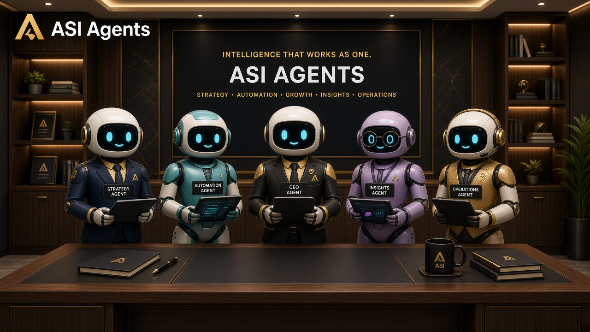
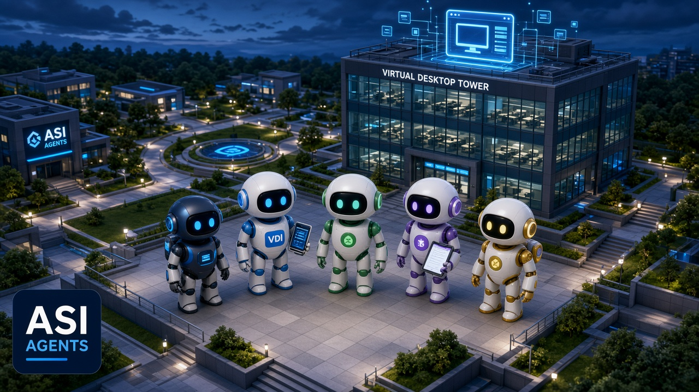

ASI Agents
Local-first multi-agent desk · research preview

v0.1 Pre Release · Port 3445 · Snapdragon X ready · Apache-2.0

  &nbsp;  
 
<em>Chief · specialists · skills · Virtual Desktop — and the path toward wearable + companion display.</em>

A note from the researcher
I’m an AI researcher shipping this as a pre-release of ASI Agents — a local-first multi-agent desk I’m building and testing in the open.

The goal isn’t another chat demo. It’s a next-generation agent suite you can run beside you: a Chief, specialists with skills, honest approvals, and an on-device AMS intent router — then escalate to local chat or cloud only when the route needs it.

I’m also building toward the associated tools that make that suite feel real in daily life — especially a focused wearable path and a companion display (Squari / Companion in this build) so the desk isn’t trapped in one window forever.

This repo is that stake in the ground. APIs and UI will move. Stars, issues, and sharp notes help. Please don’t strip the license or claim the work as your own.

— V Varghese · @asiagents · 2026

Stack at a glance

  You
   │
   ▼
 AMS on-device router   (Micro 70M default · Hybrid 120M optional — ONNX in models/ams/)
   │
   ▼
 ASI Agents desk        (Super · Multi · Pro · skills · approvals · Panic)
   │
   ▼
 Virtual Desktop        (apps · browser · files)
   │
   ▼
 Companion / wearable   (companion display on now; wearable track next)
Getting started
First run? Double-click start-asi.cmd, then open http://127.0.0.1:3445

One click (Windows / Snapdragon): start-asi.cmd (setup + build on first run).

Or three commands (Node 20+; prefer ARM64 on Snapdragon X / Galaxy Book):

npm.cmd run setup
npm.cmd run build
npm.cmd run start
Models in this package
File	Role
models/ams/ams-micro-70m.onnx	Default on-device intent router (~70M brand)
models/ams/ams-hybrid-120m.onnx	Optional richer router (~120M brand)
Verify: npm run verify:ams. Optional chat models: .\scripts\pull-models.cmd. Without a chat backend, Chief returns 503 (fail-closed).

Large ONNX files may use Git LFS. Clone with Git LFS installed if weights don’t appear as full binaries.

HF mirrors (optional): ams-micro-70m · ams-hybrid-120m

Modes
Mode	Feel	Best for
Super Agent	Chief-centered thread	Daily work
Multi Agents	Live groups / parallel work	Shared tasks
Pro Agents	Specialist roster + skills	Deep research & builds
(Older “Simple / Pro” labels in early notes map into this Super · Multi · Pro shell.)

Modules
Module	Pre-release status
Virtual Computer / Desk	Installed; desk daemon :3456 optional via ASI_DESK_REPO
Companion display	ON on localhost / 127.0.0.1 (Settings → Modules → Show Squari elsewhere)
Wearable	Research track — associated hardware/tools coming with the suite
Arcade / games are not in this package. Postgres stays off (files by default).

Highlights
Local-first · no account required to start
Per-agent primary + secondary models with visible handoffs
Draft-first inbox · Approve / Ask more / Reject
Header Panic · Local / Wi‑Fi model toggles
Hardware scan → what your machine can run
License
Apache License 2.0 — see LICENSE.

Copyright © 2026 V Varghese / ASI Agents.

ASI Agents · v0.1 Pre Release · intelligence that works as one
Desk today · companion display · wearable next

